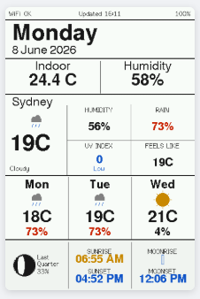

# PaperColor WeatherDash

A feature-rich weather dashboard and photo display for the **M5Stack PaperColor** (ESP32-S3R8, ACeP 6-colour e-paper, 400×600px). Built as a low-power companion display to the Tab5 Observatory dashboard.

  

---

## Features

**4 display pages** — navigated via hardware buttons A/B:

| Page | Description |
|------|-------------|
| 1 — Dashboard | Current weather, indoor temp/humidity, UV index, rain chance, 3-day forecast, moon phase + AQI strip |
| 2 — Hourly Graph | Temperature curve + rain bars for 06:00–22:00, wind/pressure/visibility stats |
| 3 — Calendar | Month calendar with today highlighted, outdoor + indoor conditions header |
| 4 — Photo | Full-screen photo display from SD card with slideshow mode |

**Web UI** (press Button C) — full browser-based control panel at `http://<device-ip>`:
- Live sensor readings and history charts with time range filters (1hr → 90 days)
- Photo library — upload, display, delete, and slideshow control
- Wake schedule editor
- Full RGB LED control (solid, pulse, flash, rainbow, status-driven)
- Display preview via screenshot endpoint
- Manual sensor readings logged to SD

**Smart sleep/wake cycle** — wakes at scheduled times, fetches weather, renders, sleeps. Target battery life: weeks on a 1250 mAh cell at 1-hour intervals.





---

## Hardware

| Component | Detail |
|-----------|--------|
| MCU | ESP32-S3R8 — 240 MHz dual-core |
| Display | 4" ACeP / Spectra 6 e-paper, 400×600, **6 colours** |
| Colours | Black, White, Red, Yellow, Green, Blue — no true orange |
| RTC | RX8130CE |
| Temp/Humidity | SHT40 onboard sensor |
| Power IC | M5PM1 (I2C address `0x6E`) |
| RGB LEDs | 2× WS2812B on GPIO21 |
| SD Card | microSD — CS=47, SCK=15, MOSI=13, MISO=14 |
| Battery | 1250 mAh LiPo |

---

## Required Libraries

> ⚠️ **M5GFX and M5Unified must be installed from GitHub ZIP** — the Library Manager versions do not support the PaperColor board target and the display will report 0×0.

| Library | Version | Install |
|---------|---------|---------|
| Board Manager | M5Stack >= 3.2.7, target: **M5PaperColor** | Arduino Board Manager |
| M5Unified | >= 0.2.17 | [GitHub ZIP](https://github.com/m5stack/M5Unified) |
| M5GFX | >= 0.2.22 | [GitHub ZIP](https://github.com/m5stack/M5GFX) |
| M5PM1 | latest | Library Manager or [GitHub](https://github.com/m5stack/M5PM1) |
| M5UnitENV | latest | Library Manager |
| ArduinoJson | v6.x | Library Manager |
| Adafruit NeoPixel | >= 1.15.4 | Library Manager |

---

## Configuration

Create a `config.h` file in the sketch folder alongside the `.ino` file. **Do not commit this file** — add it to `.gitignore`.

```cpp
#pragma once
#define WIFI_SSID        "your_wifi_ssid"
#define WIFI_PASSWORD    "your_wifi_password"
#define WEATHER_API_KEY  "your_weatherapi_key"   // https://www.weatherapi.com
```

The weather endpoint is set in the sketch to fetch Sydney, Australia. Change the `q=Sydney` parameter in `WEATHER_URL` for a different location.

---

## Data Sources

| Source | Used for |
|--------|----------|
| [WeatherAPI.com](https://www.weatherapi.com) | Current conditions, 3-day forecast, hourly data, astronomy, AQI |
| SHT40 onboard sensor | Indoor temperature and humidity |
| SD card `/sensors/log.csv` | Sensor history (up to 720 entries, ~90 days) |
| SD card `/photos/*.bmp` | Photo slideshow |

WeatherAPI free tier is sufficient. The sketch uses the `forecast.json` endpoint with `aqi=yes`.

---

## SD Card

The sketch creates two directories on first boot:

- `/photos/` — uploaded photos saved as 24-bit BMP (400×600)
- `/sensors/` — `log.csv` with timestamped temperature, humidity, and battery readings

Photos are uploaded through the web UI — the browser handles resizing, cropping, and Floyd-Steinberg dithering to the 6-colour hardware palette before sending to the device.

---

## Web UI

Press **Button C** to enter web mode. The display shows the device IP address. Open `http://<ip>` in any browser on the same network. Press **Button C** again to exit.

The web UI includes six tabs:

- **Dashboard** — live readings, battery status, WiFi signal, SD card status
- **Sensors** — temperature/humidity/battery charts with 1hr/8hr/24hr/7d/30d/90d range chips, Take Reading button
- **Schedule** — configure wake hours and interval
- **Settings** — set default page (1–4) with live display preview, LED quick controls
- **Photo** — upload images, view/display/delete photos on SD, start/stop slideshow with interval selector
- **LEDs** — full RGB LED control with 6 modes and colour picker

> POST routes that trigger a display render (`/api/page`, `/api/refresh`, `/api/photos/display`) block until the ACeP panel finishes refreshing (~25 seconds) before responding. This is expected.

---

## Button Reference

| Button | Normal mode | Web mode |
|--------|-------------|----------|
| A (GPIO10) | Previous page (wraps 4→1) | — |
| B (GPIO9) | Next page (wraps 1→4) | — |
| C (GPIO1) | Enter web mode | Exit web mode |
| Power | Double-click to wake from deep sleep | — |

---

## Sleep / Wake

The device uses M5PM1-based deep sleep (`pm1.timerSet()` + `pm1.shutdown()`). `M5.Power.timerSleep()` is unreliable on this hardware.

| Mode | Behaviour |
|------|-----------|
| Weather pages (1–3) | Sleeps until next scheduled wake slot |
| Photo mode, slideshow off | Stays awake indefinitely |
| Photo mode, slideshow on | Sleeps for the slide interval between photos |

The default schedule wakes every hour from 06:00–20:00 AEST. Configurable via web UI.

---

## LED Status Indicators

The two WS2812B LEDs show boot progress in Status mode (default):

| Colour | Phase |
|--------|-------|
| Blue | Booting |
| Amber | Connecting to WiFi |
| Green | Fetching weather |
| White | Rendering to display |
| Bright blue | Web mode active |
| Off | Sleeping |

LED mode can be changed to solid, pulse, flash, or rainbow via the web UI.

---

## ACeP Colour Notes

The hardware panel renders exactly **6 colours**. All other RGB values are quantised to the nearest palette colour — subtle tints and gradients will not render as expected.

| Colour | RGB565 | Hex |
|--------|--------|-----|
| Red | `0xC900` | `#CC2200` |
| Yellow | `0xCC40` | `#CC8900` |
| Green | `0x1B45` | `#1A6B2A` |
| Blue | `0x12B9` | `#1155CC` |
| Black | `0x18C3` | `#1A1A1A` |
| White | `0xFFFF` | `#FFFFFF` |

Every display refresh takes ~25 seconds regardless of the `epd_mode` setting.

---

## Project Structure

```
PaperColor_WeatherDash/
├── PaperColor_WeatherDash.ino   # Main sketch (~3800 lines)
├── config.h                     # WiFi + API credentials (not committed)
└── README.md
```

---

## Credits

- Built for the [M5Stack PaperColor](https://docs.m5stack.com/en/core/PaperColor)
- Weather data from [WeatherAPI.com](https://www.weatherapi.com)
- Companion project to the Tab5 Observatory dashboard
- Location: Sydney, Australia (Fort Denison / AEST)

---

## Licence

MIT — free to use, modify, and distribute. Not affiliated with M5Stack or WeatherAPI.
